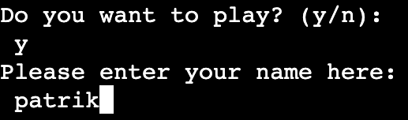
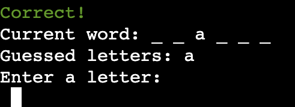

# HANGMAN

* Hangman is a python terminal, wich runs in the Code Insitute mock terminal on Heroku.
It is a game about guessing words that will test the users creativity. A fun and perfect game for anyone who wants a brake from everyday stress. 

  

## Flowchart

* Flowchart was created using [lucidchart](https://www.lucidchart.com/pages/)

  

## Features

* Welcome message

  

* Goodbuy message

  

* Enter username

  

* New game is starting

  

* Correct guessed letter

  

* Incorrect guessed letter and first level of hangman

  

* Correct guessed word

  

* Incorrect guessd word and last level of hangman

  

* Exit game

  

## Features left to implement

* Add different difficulty levels

## Testing

### Validator testing 

#### run.py, hangman.py and list.py

* No errors where found using [CI Python Linter](https://pep8ci.herokuapp.com/#)

  

### Manuell testing

| Action | Expectation| Result|
| --- | --- | --- |
| Type "n" when game ask if user wants to play | A message "See you next time. Goodbye!" appears | A message "See you next time. Goodbye!" appears |
| Type "y" when game ask if user wants to play | A message "Please enter your name here:" appears | A message "Please enter your name here:" appears |
| Type less than 3 letter when asked to enter username | A message "Sorry. Username must be at least 3 letters or more" appears | A message "Sorry. Username must be at least 3 letters or more" appears |
| Type in numbers when asked to enter username |  A message "Sorry. Letters only!" appears | A message "Sorry. Letters only!" appears |
| Type in username (3 letter or more) | A message "Hello, username" appears and the game starts | A message "Hello, username" appears and game the starts |
| Guess an incorrect letter | A red message "Incorrect" with the first level of hangman appears and letter is placed after "Guessed letters:" | A red message "Incorrect" with the first level of hangman appears and letter is placed after "Guessed letters:" |
| Guess an correct letter | A green message "Correct" appears and letter is placed after "Current word:" | A green message "Correct" appears and letter is placed after "Current word:" |
| Guess correct word | "Correct!. The word was: (correct). Do you want to play again? (y/n):" appears | "Correct!. The word was: (correct). Do you want to play again? (y/n):" appears |
| Guess wrong 7 times | Last level of hangman with the message Incorrect!. Game over! The word was: (word). Do you want to play again? (y/n): appears | Last level of hangman with the message Incorrect!. Game over! The word was: (word). Do you want to play again? (y/n): appears |
| Type "exit" during game | "Do you want to exit the game? (y/n):" appears | "Do you want to exit the game? (y/n):" appears |
| Type "y" when asked to exit game | "Exiting the game" appears | "Exiting the game" appears |
| Type "n" when asked to exit game | Game continues | Game continues |

## Bugs and fixes

* No bugs have been detected

## Deployment

* This game was deployed to Heroku
  * Sign up for Heroku
  * Click "create new app"
  * Give the app a unique name
  * Click settings in the section on top of the page
  * Scroll down and press "Add buildpack"
  * Click python first then nodejs (in that order)
  * Click deploy in the section on top of the page
  * Select method "Connect to Github" then press "Connect to Github" button 
  * Search for hangman
  * Click connect
  * Click "Enable automatic deploys" button to enable Heroku to rebuild the app when a new change is pushed to Github
  

## Credits

* My mentor Gareth McGirr
* Roman from Code Institute who help with resolving deployment issues